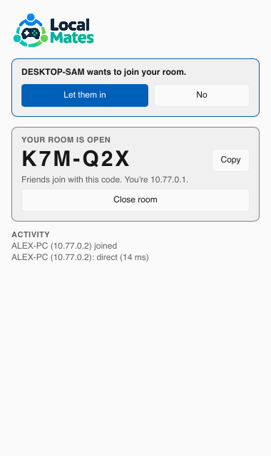

<h1>
  <picture>
    <source media="(prefers-color-scheme: dark)" srcset="docs/logo-dark.png">
    
  </picture>
</h1>

Dead-simple virtual LAN for playing LAN games with friends. Open your room, share its code, play. No accounts; rooms you've joined are remembered so you can hop back in.

Windows-first, also runs on macOS and Linux. Work in progress.

## Usage

Open **Local Mates** (`local-mates-app`). The first time, it asks to set up its background service — the one admin prompt. Then open your room and share the code, or type a friend's code to join. Closing the window keeps it in the tray, where it pops back up when someone wants to join; Quit from the tray menu leaves any session running.



### Command line

`local-mates` does everything the app does. A small background service owns the virtual adapter, so it's the only part that needs admin:

```sh
local-mates service install   # Windows, once, from an admin terminal
sudo local-mates daemon       # macOS/Linux, in another terminal
```

Then, as a normal user:

```sh
local-mates host           # open your room; prints its code (e.g. K7M-Q2X)
local-mates join K7M-Q2X   # on your friend's machine; the room is saved
local-mates join "Jake's room"   # reconnect to a saved room later
local-mates leave          # or Ctrl-C
local-mates rooms          # your code and saved rooms; also forget, reset-code
```

Your room's code never changes unless you run `reset-code`. The host is `10.77.0.1`; joiners get `10.77.0.2` and up. Each side prints whether the link is direct or relayed. Without a service running, `host`/`join` run it in-process, which then needs admin/root itself. On Windows, `wintun.dll` must sit next to `local-mates.exe` (CI builds bundle it).

## How it works

- [iroh](https://iroh.computer) for encrypted peer-to-peer QUIC with NAT hole-punching, falling back to relays.
- [Wintun](https://www.wintun.net) (via `tun-rs`) for the virtual adapter; utun/tun on macOS/Linux.
- The host acts as a hub: joiners' IP packets travel as QUIC datagrams, and broadcast/multicast (how LAN games discover each other) is fanned out to everyone.
- On Windows the adapter gets the lowest route metric so game broadcasts go out of it, and is marked as a Private network so the firewall doesn't block games.
- [Velopack](https://velopack.io) handles install and auto-updates from GitHub Releases: new versions download in the background and install on next launch.

## Server side

`deploy/local-mates` is a Helm chart with two parts:

- **relay** (`relay/`): the official [iroh relay](https://crates.io/crates/iroh-relay). Needs public TCP 443 and UDP 7842 reachable directly — UDP is how clients learn their public address for hole-punching, so it can't sit behind an HTTP proxy or tunnel.
- **rooms** (`server/`): turns short codes into the host's iroh id while the room is online. Plain HTTP, in-memory, rate-limited per IP; put it behind any ingress or tunnel. A room's code is derived from its id (`proto/`), so the server stores nothing durable.

```sh
helm install mates oci://ghcr.io/starkey-digital/charts/local-mates \
  --set relay.hostname=relay.example.com --set relay.tls.clusterIssuer=letsencrypt \
  --set rooms.ingress.enabled=true --set rooms.ingress.host=rooms.example.com
```

Point the app at a different rooms server with `LOCAL_MATES_API=https://rooms.example.com`.

## Releasing

Bump `version` in `Cargo.toml`, then push a matching tag (`v0.2.0`). The Release workflow publishes the Windows installer to GitHub Releases (installed copies pick it up), plus the server images and chart to GHCR.
